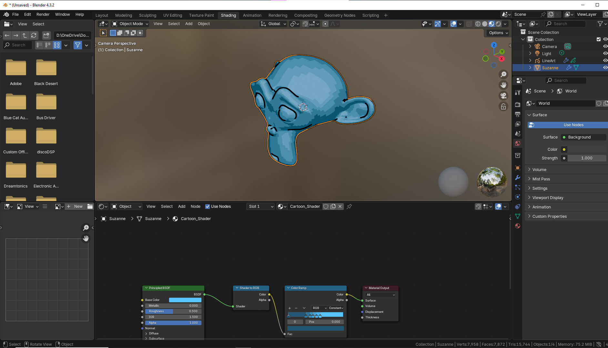

# 3D: A: Lighting Models – Cartoon

This plugin serves as a simple cartoon shader for objects in Blender.  

  

  

## User Documentation
The plugin is made for Blender and allows easy creation of a cartoon-style material with adjustable number of shades, main color, and outlines. The shader works best for 3D objects with a higher face count.  

### Installation
1. Place the downloaded folder into the Blender directory: `..../Blender/version/scripts/addons`.  
2. In Blender, go to *Edit > Preferences > Add-ons* and enable *Cartoon Shader*.  

### Usage
In the 3D Viewport, press **N** to open the right panel. Switch to the *Cartoon Shader Creator* tab. Here you can set the material parameters and generate the shader by clicking **Generate Cartoon Shader**.  

Since the plugin also creates an outline for the cartoon effect, an active object must be selected when generating.  

---

## Theoretical Documentation

### Parameters
- **Main Color:** The lightest color for the material, from which the other shades are automatically calculated.  
- **Number of Shades:** The number of steps in the color gradient. Each shade is derived from the main color by reducing its intensity.  
- **Outline Thickness:** The thickness of the object’s outline.  

### Cartoon Shader Principle
1. **Shader:** The material is created using nodes in Blender:  
   - **Principled BSDF:** Base shader with the main color.  
   - **Shader to RGB:** Converts lighting into RGB color values.  
   - **Color Ramp:** Generates the color gradient. Set to constant interpolation to simulate the cartoon effect (sharp color transitions).  

2. **Outlines:** Created using **Grease Pencil Line Art**. They depend on the current camera and generate as a static line art object, drawing the outline of the mesh relative to the camera view.  

### Color Ramp Element Positions
The positions of the elements in the Color Ramp are pre-defined in the array **shades_positions**.  
Initially, the idea was to place them evenly according to the number of elements, but that often required tedious manual adjustments by the user. The predefined positions are closer to what users typically want, so less manual tweaking is required.  

### Color Scaling
To scale the colors, a *scale factor* is calculated and applied to each R, G, and B channel of the chosen base color. The scale factor depends on the total number of shades:  

Scale factor = `1 - (1 / number_of_shades) * shade_index`  

```python
# Get the initial color
base_color = main_color[:3]  # Ignore alpha
alpha = main_color[3]

# Add elements based on the number of shades
for i in range(num_shades):
    pos = self.shades_positions[num_shades-1][i]
    print(pos)
    element = color_ramp_node.color_ramp.elements.new(pos)

    # Calculate the new color
    scale_factor = 1.0 - (i * (1 / num_shades))
    scaled_color = [channel * scale_factor for channel in base_color] + [alpha]

    element.color = scaled_color
```

## Programmer Documentation

#### Class `MATERIAL_OT_cartoon_shader`
- **Purpose:** Generates a cartoon shader and adds outlines.
- **Methods:**
  - `execute(self, context)`: 
    1. Gets the currently active object.
    2. Creates the shader using `create_cartoon_shader`.
    3. Adds outlines using `create_outline`.
  - `create_cartoon_shader(self, scene)`:
    - Builds a material node tree:
      1. Removes the default nodes.
      2. Adds **Principled BSDF**, **Shader to RGB**, **Color Ramp**, and **Material Output**.
      3. Configures the **Color Ramp** based on the chosen number of shades.
  - `create_outline(self, scene)`:
    - Adds outline strokes using **Grease Pencil Line Art** relative to the camera. The line thickness depends on the **Thickness** parameter chosen by the user.

#### Class `MATERIAL_PT_cartoon_shader_panel`
- **Purpose:** UI for setting parameters and generating the shader.
- **Methods:**
  - `draw(self, context)`: Adds UI controls for parameters and the button to generate the shader.

### Property Management
- **Function `init_properties`:** Initializes default scene property values.
- **Function `clear_properties`:** Removes scene properties when unregistering the plugin.

### Registration and Unregistration
- **Function `register`:** Registers the operator and panel, initializes properties.
- **Function `unregister`:** Unregisters the operator and panel, clears properties.

## Development
The plugin was inspired by the following videos:
- https://www.youtube.com/watch?v=8HHQUD3HxdY&pp=ygUWY2FydG9vbiBzaGFkZXIgYmxlbmRlcg%3D%3D
- https://www.youtube.com/shorts/JLCs98lpR_Q
- https://www.youtube.com/watch?v=bViS42E8Y4M&pp=ygUWY2FydG9vbiBzaGFkZXIgYmxlbmRlcg%3D%3D
- https://www.youtube.com/watch?v=NPZq_GYtx28&pp=ygUWY2FydG9vbiBzaGFkZXIgYmxlbmRlcg%3D%3D

ChatGPT was also used for debugging and problem solving, for example:  
**Question:**  doesnt the last element in the color ramp stay white there, cause our clear function for the ramp elements before adding new ones leaves one there? shouldnt we delete it at the end?
**Answer:** (PS: This answer is incorrect, because Color Ramp always needs at least one element, so you can't delete all at once. The last default element needs to be deleted after adding our elements.)<br/>
```
Yes, you're correct! The default Color Ramp node always retains at least one element after clearing because Blender requires at least one element to exist at all times.

In your current code, when you clear the elements and then add new ones, the first element remains from the original ramp unless you explicitly remove it. This can cause the last element to stay white (the default color) unless overwritten.

Fixing the Issue
You can explicitly remove the last remaining element before adding new ones. Here's an updated version of your create_cartoon_shader function to address this:

# Customize the Color Ramp with the number of shades
color_ramp_node.color_ramp.interpolation = 'CONSTANT'

# Clear all existing elements
while len(color_ramp_node.color_ramp.elements) > 1:
    color_ramp_node.color_ramp.elements.remove(color_ramp_node.color_ramp.elements[0])

# Remove the last remaining element to start fresh
color_ramp_node.color_ramp.elements.remove(color_ramp_node.color_ramp.elements[0])

# Add new elements based on the number of shades
for i in range(self.num_shades):
    pos = i / max(self.num_shades - 1, 1)
    element = color_ramp_node.color_ramp.elements.new(pos)
    element.color = (pos, pos, pos, 1)  # Example: grayscale colors based on position

Explanation
Clearing Elements: The while loop removes elements until there is only one element left.
Removing the Last Element: After the loop, we remove the last remaining element to ensure the ramp is completely empty.
Adding New Elements: We then add new elements based on self.num_shades.
This approach ensures you start with a clean slate for the color ramp and avoid unwanted default white elements.
```
